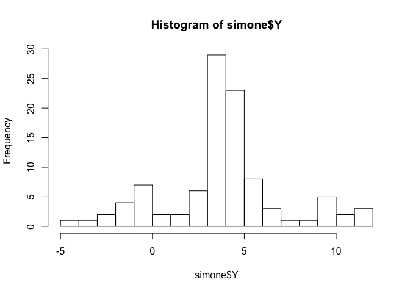
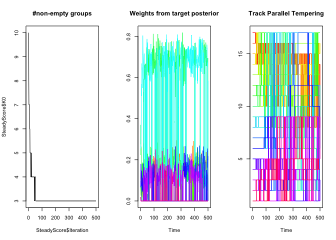
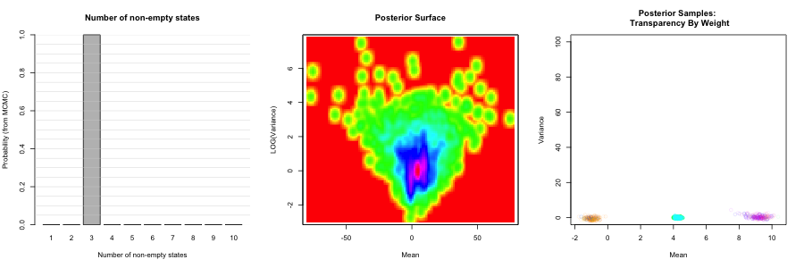
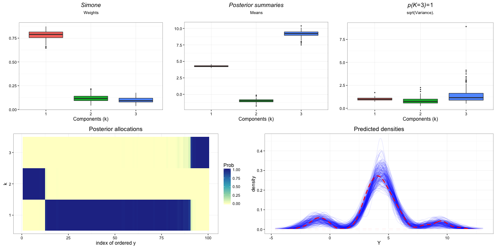

Install Zmix
============

To install the latest version of the Zmix package from github


```{r}
library(roxygen2)
library(devtools)
install_github('zoevanhavre/Zmix')
library(Zmix)
```

Simple Example
==============

Let's generate some data from a mixture of three Gaussian components. Using the Zmix function provided, a Gaussian mixture can be simulated from given the model parameters \(\mu_k\), \(\sigma_k\), and mixture weights \(\pi_k\) for \(k=1,\dots, K\):

``` r
simone<-simudZ(n=100,
               mu=c(-1,4,10),
               sig=c(1,1,2),
               p=c(.2, .7, .1),
               k=3)
#the output includes both the simulated data,
# and each observation's allocation as "Z".
lapply(simone, head)
```

    ## $Y
    ## [1]  3.526882  4.880605 -1.989098  3.404140  2.320297 -1.410440
    ## 
    ## $Z
    ## [1] 2 2 1 2 2 1

<!-- -->

Let's run Zmix, fitting 10 components to these data.

``` r
run1 <- Zmix_univ_tempered(simone$Y,iter=500,k=10) 
```

    ## 
      |                                                                       
      |                                                                 |   0%
      |                                                                       
      |=============                                                    |  20%
      |                                                                       
      |==========================                                       |  40%
      |                                                                       
      |=======================================                          |  60%
      |                                                                       
      |====================================================             |  80%
      |                                                                       
      |=================================================================| 100%

<!-- --> Post processing: main function

``` r
pp_run1<-Process_Output_Zmix(run1,Pred_Reps=200, Zswitch_Sensitivity=0.01, isSim=FALSE, Plot_Title="Simone", SaveFileName="Zmix_Run1", Burn=200)
```

    ## NULL
    ##   K0 Probability      MAE      MSE Pmin Pmax Concordance     MAPE     MSPE
    ## 1  3           1 83.86598 113.2284 0.12 0.84     0.94425 96.54466 149.0588

### Result Tables:

``` r
pp_run1[[1]]
```

    ##   variable factor(k)              value K0
    ## 1        P         1    0.69(0.57,0.79)  3
    ## 2       Mu         1    3.98(3.68,4.25)  3
    ## 3      Sig         1     1.09(0.76,1.6)  3
    ## 4        P         2    0.18(0.11,0.26)  3
    ## 5       Mu         2 -1.24(-2.04,-0.51)  3
    ## 6      Sig         2    1.94(0.92,4.03)  3
    ## 7        P         3    0.14(0.07,0.23)  3
    ## 8       Mu         3   9.49(8.06,10.77)  3
    ## 9      Sig         3    2.38(0.86,6.73)  3

``` r
pp_run1[[2]]
```

    ##   K0 Probability      MAE      MSE Pmin Pmax Concordance     MAPE     MSPE
    ## 1  3           1 83.86598 113.2284 0.12 0.84     0.94425 96.54466 149.0588

The plots this makes can be found in the working directory. This includes: 


